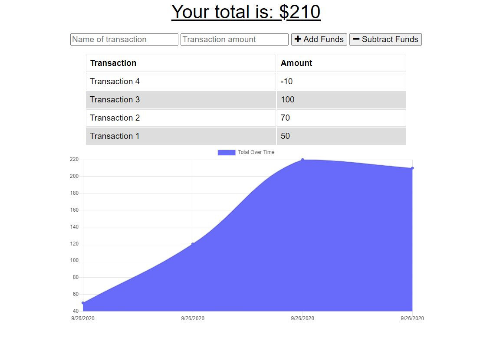

# badget-tracker

This application is for Badget Tracking that allows for offline functionality. 
The user is able to add expenses and deposits to their budget with or without a connection. If the user enters transactions offline, the total gets updated when they're brought back online. 

# Technologies used

* Node.js
* Express.js
* MongoDB, 
* Progressive Web Application: IndexedDB, Service Worker
* Heroku, Altas MongoDB

# GitHub repository

https://github.com/evkonradi/badget-tracker

# Deployed application:

https://arcane-ravine-44020.herokuapp.com/

# Page preview

This is the preview of the initial page:
